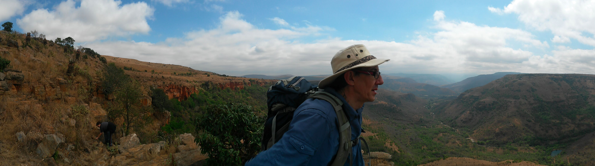

= Introduction to Gradle
Schalk Cronjé <ysb33r@gmail.com>
:snippets: ../snippets
:sourcedir: ../../../examples
:gradledsl: http://gradle.org/docs/{gradlever}/dsl
:revealjs_keyboard: true
:revealjs_overview: true
:revealjs_theme: white
:revealjs_controls: true
:revealjs_history: true
:revealjs_slideNumber : true
:revealjs_center: true
coderay-css: styles/asciidoctor-coderay.css

== About me

* Email: ysb33r@gmail.com
* Twitter / Ello : @ysb33r

Gradle plugins authored/contributed to: VFS, Asciidoctor, JRuby family (base, jar, war etc.), GnuMake, Doxygen

== Get Your Daily Gradle Dose

@DailyGradle

#gradleTip

== Gradle

[quote]
--
A next generation build-and-deploy pipeline tool
--

include::slides/first-project.adoc[]

include::slides/dsl1.adoc[]

include::slides/groovy.adoc[]

include::slides/dsl2.adoc[]

== Building Groovy & Scala

* Both languages have built-in support

== Building Ruby

include::slides/jruby.adoc[]

== Other Languages

* C++ / C / ASM / Resources (built-in)
* Clojure (plugin)
* Frege (plugin)
* Golang (plugin)
* Gosu (plugin)
* Mirah (plugin in progress)

== Support for Other Buildsystems

* ANT (built-in)
* GNU Make
* MSBuild / xBuild
* Grunt
* Anything else craftable via `Exec` or `JavaExec` task

== Documentation

include::slides/documentation.adoc[]

include::slides/publishing.adoc[]

== More support...

* Official buildsystem for Android
* Docker
* Hadoop

== Endgame

* Gradle is breaking new ground
* Ever improving native support
* Continuous performance improvements
* Go find some more plugins at https://plugins.gradle.org

== About this presentation

* Written in Asciidoctor
* Styled by asciidoctor-revealjs extension
* Built using:
** Gradle
** gradle-asciidoctor-plugin
** gradle-vfs-plugin
* Code snippets tested as part of build
* Source code: https://github.com/ysb33r/GradleLectures/tree/AccuLondon

== Thank you

* Email: ysb33r@gmail.com
* Twitter / Ello : @ysb33r

Keep an eye out for https://leanpub.com/idiomaticgradle

== Migrations

== Ant to Gradle

Reflect Ant Build into Gradle

[source,groovy]
----
ant.importBuild('build.xml')
----

== Maven to Gradle

Go to directory where `pom.xml` is and type

[source,bash]
----
gradle init --type pom
----

