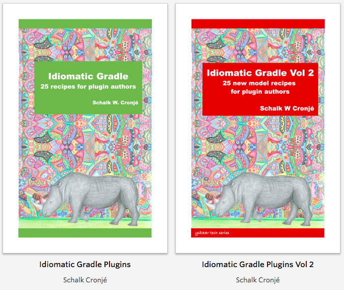

= Gradle in 45min
Schalk Cronjé <ysb33r@gmail.com>
:snippets: ../snippets
:sourcedir: ../../../examples
:gradledsl: http://gradle.org/docs/{gradlever}/dsl
:revealjs_keyboard: true
:revealjs_overview: true
:revealjs_theme: beige
:revealjs_controls: true
:revealjs_history: true
:revealjs_slideNumber : true
:revealjs_center: false
:docinfo1:
coderay-css: styles/asciidoctor-coderay.css

== About me

* Email: ysb33r@gmail.com
* Twitter / Ello : @ysb33r

image::images/SchalkPanarama.jpg[]

Gradle plugins authored/contributed to: VFS, Asciidoctor, JRuby family (base, jar, war etc.), GnuMake, Doxygen

== Get Your Daily Gradle Dose

image::images/gradle-logo-pink.png[height="250",width="250"]

@DailyGradle

#gradleTip

== {nbsp}

=== SdkMan

* Manages parallel version of multiple SDKs
* Mostly for (but not limited to) JVM-related systems
* Windows users can use Posh-GVM (Powershell)
** Windows 10 Bash ??

[source,bash]
----
curl -s http://get.sdkman.io | bash
----

=== SdkMan

* *SdkMan*: http://sdkman.io
* *Posh-GVM*: https://github.com/flofreud/posh-gvm
* @sdkmanager

== Gradle

[quote]
--
A next generation build-and-deploy pipeline tool
--

include::slides/first-project.adoc[]

include::slides/dsl1.adoc[]

include::slides/groovy-intro.adoc[]

include::slides/tasks.adoc[]

include::slides/dsl2.adoc[]

include::slides/command-line.adoc[]

== Support for other JVM Languages

include::slides/groovy.adoc[]

include::slides/scala.adoc[]

include::slides/kotlin.adoc[]

include::slides/jruby.adoc[]

== Other Languages

* C++ / C / ASM / Resources (built-in)
* Clojure (plugin)
* Frege (plugin)
* Golang (plugin)
* Gosu (plugin)
* Ceyon (plugin)
* Mirah (plugin)

== Support for Other Buildsystems

* ANT (built-in)
* GNU Make
* MSBuild / xBuild
* Grunt, Gulp
* Anything else craftable via `Exec` or `JavaExec` task

include::slides/documentation.adoc[]

include::slides/publishing.adoc[]

== More support...

* Official buildsystem for Android
* Docker
* Hadoop

include::slides/thewholehog.adoc[]

== Endgame

* Gradle is breaking new ground
* Ever improving native support
* Continuous performance improvements
* Go find some more plugins at https://plugins.gradle.org

== About this presentation

* Written in Asciidoctor
* Styled by asciidoctor-revealjs extension
* Built using:
** Gradle
** gradle-asciidoctor-plugin
** gradle-vfs-plugin
* Code snippets tested as part of build
* Source code: https://github.com/ysb33r/GradleLectures/tree/Jbcn2016

== Writing Plugins?

https://leanpub.com/b/idiomaticgradle

== Thank you

* Email: ysb33r@gmail.com
* Twitter / Ello : @ysb33r
* #idiomaticgradle

(Just in-case you need a buildtool consultant)

== Migrations

=== Ant to Gradle

Reflect Ant Build into Gradle

[source,groovy]
----
ant.importBuild('build.xml')
----

=== Maven to Gradle

Go to directory where `pom.xml` is and type

[source,bash]
----
gradle init --type pom
----

== Useful Stuff

=== Publishing via VFS

[source,groovy]
----
include::snippets/vfs.gradle[]
----

